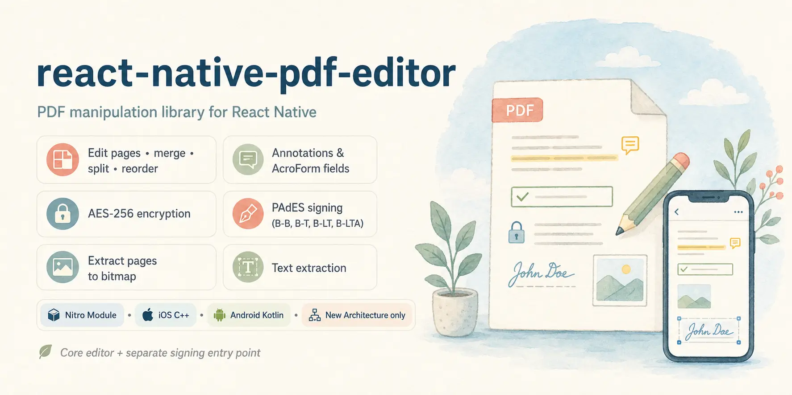

# react-native-pdf-editor



`react-native-pdf-editor` is a React Native library for editing, manipulating, and signing PDF documents natively on mobile. It supports both iOS and Android.

At its core, it is a modified wrapper around a [PoDoFo](https://github.com/Doko-Demo-Doa/podofo) fork for creating, editing, and digitally signing PDFs (PAdES B-B/B-T/B-LT/B-LTA), with fast direct C++ bindings via `react-native-nitro-modules`.

So it is perfect for apps that need to generate reports or receipts, fill and annotate documents, assemble PDFs from multiple sources, protect files with passwords and permissions, render pages for previews or sharing, extract searchable text, or sign documents with external keys such as YubiKey, HSMs, and cloud KMS providers.

Note: It is still in alpha, and the API may change. Also it does not support viewing PDF, only PDF manipulation. If you want to show the PDF on UI, consider other awesome solutions:

- [react-native-pdf-jsi](https://github.com/126punith/react-native-pdf-jsi)
- [react-native-pdf-viewer](https://github.com/alpha0010/react-native-pdf-viewer)
- [react-native-pdf](https://github.com/wonday/react-native-pdf)

[](https://www.npmjs.com/package/@doko/react-native-pdf-editor)
[](https://www.npmjs.com/package/@doko/react-native-pdf-editor)
[](https://reactnative.dev/docs/the-new-architecture/landing-page)
[](https://www.typescriptlang.org/)
[](LICENSE)
[](https://developer.apple.com/ios/)
[](https://developer.android.com/)

If you like my works, please...

[](https://buymeacoffee.com/dokodemodoa)
---

## Features

### PDF document editing

Create, open, modify, and save PDF documents directly from React Native.

Add, remove, rotate, resize, and reorder pages
Merge multiple PDF documents
Split documents or copy selected page ranges
Insert pages from another PDF
Load PDFs from file paths, with optional passwords
Save edited documents to disk

### Page painting

Draw new page content with a native PDF painter.

Draw text with standard PDF fonts or embedded custom TTF/OTF fonts
Load custom fonts from files or in-memory buffers
Embed PNG/JPEG image data and draw images onto pages
Draw vector lines, rectangles, and circles
Set RGB stroke and fill colors
Use save/restore graphics-state operations

### Annotations and form fields

Create and inspect common PDF annotations and AcroForm fields.

Create highlight, free-text, stamp, ink, and link annotations
Read annotation types and update annotation contents and rectangles
Create text box and checkbox AcroForm fields
Read field names, values, types, and checked state
Set text values and checkbox state

### Encryption

Protect documents with native PDF encryption.

Set user and owner passwords
Use AES-256 encryption for newly protected documents
Control print, copy, edit, annotation, fill-and-sign, accessibility, assembly, and high-resolution print permissions
Check whether an existing PDF is encrypted
Open encrypted PDFs with a password

### Page rendering and text extraction

Render and inspect existing PDF page content from React Native.

Render a PDF page to an RGBA8888 bitmap with `PdfRenderer.renderPageToBitmap`
Encode rendered bitmaps to PNG or JPEG files with `PdfRenderer.writeBitmapToImage`
Access rendered bitmap bytes as a zero-copy `ArrayBuffer`
Extract content-stream text from a page
Filter extracted text with a regex pattern

### Signer-agnostic PAdES signing

Sign PDFs with external keys without coupling the library to a specific key store.

Use a plain `Signer` interface for certificate chains, raw signatures, and timestamps
Plug in YubiKey, HSM, GoTrust, cloud KMS, remote-signing services, or an in-memory development key
Sign through `signPdf` or the lower-level `PdfSigningSession` workflow
Support PAdES B-B, B-T, B-LT, and B-LTA conformance levels
Add RFC3161 timestamps, DSS/LTV validation data, and archival timestamps when provided by the signer

### React Native integration

Use a small native API surface designed for modern React Native apps.

Built as a New Architecture-only Nitro Module
Uses a C++ core on iOS and Kotlin bindings on Android
Provides separate `react-native-pdf-editor` and `react-native-pdf-editor/signing` entry points
Keeps signing types out of apps that only edit PDFs

---

## Platform support

Android and iOS are **not yet** at parity - this is a temporary consequence of what is actually bindable on each platform today, not the intended final shape. iOS binds Nitro's C++ layer directly to PoDoFo's core; Android currently binds Kotlin to the already-published `podofo-android` JNI wrapper, which exposes a narrower surface. The Android API surface is expected to catch up over time as the underlying binding is expanded.

| Feature                                              | Android                                                                   | iOS                   |
| ---------------------------------------------------- | ------------------------------------------------------------------------- | --------------------- |
| Document create/open/save, page add/remove           | Full                                                                      | Full                  |
| Page rotate/resize/reorder, merge/split              | Full (build-verified)                                                     | Full (build-verified) |
| Painter (text/images/shapes), annotations            | Full                                                                      | Full                  |
| Custom/embedded TTF fonts (from a file path)         | Full (pixel-verified)                                                     | Full (build-verified) |
| Custom/embedded TTF fonts (from an in-memory buffer) | Full (build-verified)                                                     | Full (build-verified) |
| AcroForm fields (text box, checkbox)                 | Full                                                                      | Full                  |
| Radio/combo/list-box/signature fields, flattening    | Not bound                                                                 | Not bound             |
| Encryption                                           | Full                                                                      | Full                  |
| Signing (B-B/B-T/B-LT/B-LTA)                         | Full                                                                      | Full                  |
| Page rendering, text extraction                      | Full (compiles + build-verified; not pixel-tested on-device this session) | Full (pixel-verified) |

`PdfSigningSessionOptions.rootCertificate` is supported on both platforms when using PoDoFo 0.0.12 or newer.

---

## Requirements

|              | Minimum                                                                                               |
| ------------ | ----------------------------------------------------------------------------------------------------- |
| React Native | 0.79+ with the **New Architecture enabled** ([Nitro Modules](https://nitro.margelo.com/) requirement) |
| iOS          | 15.1+                                                                                                 |
| Android      | `minSdkVersion` 26 (the published `podofo-android` AAR's own manifest requires it)                    |

---

## Installation

```sh
npm install @doko/react-native-pdf-editor react-native-nitro-modules
# or
yarn add @doko/react-native-pdf-editor react-native-nitro-modules
# or
pnpm add @doko/react-native-pdf-editor react-native-nitro-modules
```

> `react-native-nitro-modules` is required as this library relies on [Nitro Modules](https://nitro.margelo.com/).

If your app's `minSdkVersion` is below 26, raise it (e.g. via `expo-build-properties`'s `android.minSdkVersion` in an Expo-managed app) - PoDoFo's own Android manifest requires it, and the manifest merger will fail otherwise.

---

## Quick start

```ts
import { PdfDocument, PdfRenderer } from '@doko/react-native-pdf-editor';

const doc = PdfDocument.create();
// or open an existing file: const doc = await PdfDocument.open('/path/to/existing.pdf');
// (pass a password as a second argument if it's encrypted)
const page = doc.createPage(612, 792);

const painter = page.createPainter();
const font = doc.getStandard14Font('Helvetica');
// or embed your own: const font = doc.loadFont('/path/to/font.ttf');
painter.setFont(font, 24);
painter.drawText('Hello from react-native-pdf-editor!', 50, 700);
painter.finishDrawing();

await doc.save('/path/to/output.pdf');

const bitmap = await PdfRenderer.renderPageToBitmap({
  path: '/path/to/output.pdf',
  pageIndex: 0,
});
// bitmap.data is a zero-copy ArrayBuffer, RGBA8888, bitmap.width x bitmap.height
```

Signing lives on its own entry point:

```ts
import { signPdf, createSigner } from '@doko/react-native-pdf-editor/signing';

const signer = createSigner({
  keyAlgorithm: 'RSA',
  certificateChain: [/* base64 DER, leaf-first */],
  rawSign: async (payloadBase64, algorithm) => {
    // back this with whatever holds the private key: an in-memory dev key
    // via react-native-quick-crypto, a PKCS#11 C_Sign, YubiKit PIV, an HSM,
    // GoTrust, a cloud KMS, ... - see the Signer interface for the shape.
    return mySign(payloadBase64, algorithm);
  },
});

await signPdf(signer, {
  inputPath: '/path/to/output.pdf',
  outputPath: '/path/to/signed.pdf',
  conformanceLevel: 'B-B',
});
```

More usage (forms, annotations, encryption, rendering, text extraction, PAdES B-T/B-LT/B-LTA) is demonstrated in the [`example/`](example/) app.

---

## Example app

A runnable example app is included in [`example/`](./example) (Expo, exercises document creation, painting, saving, rendering, and text extraction end to end).

```sh
pnpm install
pnpm example start
```

Then press `a` for Android or `i` for iOS.

---

## Contributing

- [Development workflow](CONTRIBUTING.md#development-workflow)
- [Sending a pull request](CONTRIBUTING.md#sending-a-pull-request)
- [Code of conduct](CODE_OF_CONDUCT.md)

---

## License

MIT

---

Made with [create-react-native-library](https://github.com/callstack/react-native-builder-bob)
